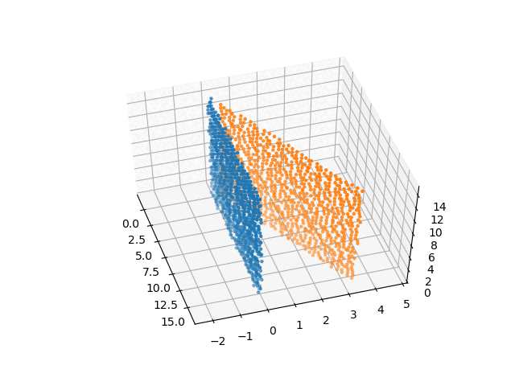

# least-squares-cpp


```least-squares-cpp``` is a header-only C++ library for unconstrained non-linear
least squares optimization using the ```Eigen3``` library.

It provides convenient and configurable access to the following fitting algorithms:

* Gradient Descent
* Gauss Newton
* Levenberg Marquardt

Convergence and runtime behaviour can be parametrized using advanced newton step refinement
operators such as line searching or trust region methods.

* Barzilai-Borwein Method
* Armijo Backtracking
* Wolfe Backtracking
* Powell's Dogleg Method

The following animation shows a pointcloud registration using Gauss Newton and Armijo Backtracking in five
iterations without initial guess.



## Install

Simply copy the header file into your project or install it using
the CMake build system by typing

```bash
cd path/to/repo
mkdir build
cd build
cmake ..
make install
```

The library requires ```Eigen3``` to be installed on your system.
In Debian based systems you can simply type

```bash
apt-get install libeigen3-dev
```

Make sure ```Eigen3``` can be found by your build system.

You can use the CMake Find module in ```cmake/``` to find the installed header.

## Usage

For examples on using different algorithms and stop criteria, please have a look at the ```examples/``` directory.

There are three major steps to use ```least-squares-cpp```:

* Implement your error function as functor
* Instantiate the optimization algorithm of your choice
* Pick the step refinement method and parameters of your choice


```cpp
#include <lsqcpp/lsqcpp.hpp>

// Implement an objective functor.
struct ParabolicError
{
    static constexpr bool ComputesJacobian = false;

    template<typename Scalar, int Inputs, int Outputs>
    void operator()(const Eigen::Matrix<Scalar, Inputs, 1> &xval,
                    Eigen::Matrix<Scalar, Outputs, 1> &fval) const
    {
        // omit calculation of jacobian, so finite differences will be used
        // to estimate jacobian numerically
        fval.resize(xval.size() / 2);
        for(lsqcpp::Index i = 0; i < fval.size(); ++i)
            fval(i) = xval(i*2) * xval(i*2) + xval(i*2+1) * xval(i*2+1);
    }
};

int main()
{
    // Create GaussNewton optimizer object with ParabolicError functor as objective.
    // There are GradientDescent, GaussNewton and LevenbergMarquardt available.
    //
    // You can specify a StepSize functor as template parameter.
    // There are ConstantStepSize, BarzilaiBorwein, ArmijoBacktracking
    // WolfeBacktracking available. (Default for GaussNewton is ArmijoBacktracking)
    //
    // You can additionally specify a Callback functor as template parameter.
    //
    // You can additionally specify a FiniteDifferences functor as template
    // parameter. There are Forward-, Backward- and CentralDifferences
    // available. (Default is CentralDifferences)
    //
    // For GaussNewton and LevenbergMarquardt you can additionally specify a
    // linear equation system solver.
    // There are DenseSVDSolver and DenseCholeskySolver available.
    lsqcpp::GaussNewtonX<double, ParabolicError, lsqcpp::ArmijoBacktracking> optimizer;

    // Set number of iterations as stop criterion.
    // Set it to 0 or negative for infinite iterations (default is 0).
    optimizer.setMaximumIterations(100);

    // Set the minimum length of the gradient.
    // The optimizer stops minimizing if the gradient length falls below this
    // value.
    // Set it to 0 or negative to disable this stop criterion (default is 1e-9).
    optimizer.setMinimumGradientLength(1e-6);

    // Set the minimum length of the step.
    // The optimizer stops minimizing if the step length falls below this
    // value.
    // Set it to 0 or negative to disable this stop criterion (default is 1e-9).
    optimizer.setMinimumStepLength(1e-6);

    // Set the minimum least squares error.
    // The optimizer stops minimizing if the error falls below this
    // value.
    // Set it to 0 or negative to disable this stop criterion (default is 0).
    optimizer.setMinimumError(0);

    // Set the parameters of the step refiner (Armijo Backtracking).
    optimizer.setStepRefiner({0.8, 1e-4, 1e-10, 1.0, 0});

    // Turn verbosity on, so the optimizer prints status updates after each
    // iteration.
    optimizer.setVerbosity(4);

    // Set initial guess.
    Eigen::VectorXd initialGuess(4);
    initialGuess << 1, 2, 3, 4;

    // Start the optimization.
    auto result = optimizer.minimize(initialGuess);

    std::cout << "Done! Converged: " << (result.converged ? "true" : "false")
        << " Iterations: " << result.iterations << std::endl;

    // do something with final function value
    std::cout << "Final fval: " << result.fval.transpose() << std::endl;

    // do something with final x-value
    std::cout << "Final xval: " << result.xval.transpose() << std::endl;

    return 0;
}
```

## Performance Considerations

The performance for solving an optimization problem with ```least-squares-cpp``` can be significantly
influenced by the following factors:

* line search, such as Armijo or Wolfe Backtracking, is expensive
  * limit the maximum number of iterations for line search algorithms
    * if you do not have a full analysis of your objective, numerics can do funny things and the algroithm can get stuck for quite some time in line search loops
* calculating jacobians numerically by finite differences is expensive and has low precision
  * consider providing an explicit jacobian in your error functor
  * consider using algorithmic differentiation in your error functor (not necessarily faster, but more precise)
* parallelize your error functor
  * usually calculations for different parts of an error vector can be done independently
* compile in ```Release``` mode
  * ```Eigen3``` uses a lot of runtime checks in ```Debug``` mode, so there is quite some performance gain

## References

[1] Jorge Nocedal, Stephen J. Wright, Numerical Optimization, Springer 1999


